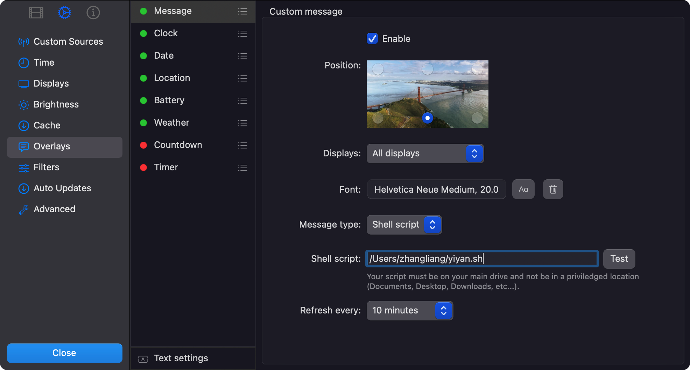

# YiYan_Shell
[一言](https://developer.hitokoto.cn/)语句/骚话/鸡汤获取的Shell脚本。

Shell script obtained by YiYan statement.

不同于一言API的纯洁文本模式（encode=text），YiYan_Shell可以做到连同语句的出处、作者、添加者一起输出。

Different from the pure text mode (encode=text) of Yiyan API, Yi Yan _ Shell can output the source, author, and contributor of the sentence.

|  示例   |        一言API纯洁文本模式         |                         YiYan_Shell                          |
| :-----: | :--------------------------------: | :----------------------------------------------------------: |
| Example |      YiYan API pure text mode      |                         YiYan_Shell                          |
|    1    | 我们把世界看错，反说它欺骗了我们。 | 我们把世界看错，反说它欺骗了我们。 「 飞鸟集 」 —— 泰戈尔 —— By 恏戋余 |
|    2    |       笑口常开，好彩自然来！       | 笑口常开，好彩自然来！ 「 好彩妹 」 By 三清大帝在上  |
|    3    |        这不是神经病，是理想        | 这不是神经病，是理想 「 大话西游之紫霞仙子 」 By papi |
|    4    |      因为喜欢你，所以喜欢你。      | 因为喜欢你，所以喜欢你。 「 茶 」 By YukoAsuka zhangliang@zha |

如果语句的作者无出处，被标识为null，来自网络，无等等类似的无意义词语，则会被跳过，如上示例2、3。

If the author of the sentence has no source, is marked as null, comes from the Internet, nothing and similar meaningless words, it will be skipped, as in examples 2 and 3.

## So，YiYan_Shell能做什么？So, what can Yi Yan _ Shell do?

- 自动显示在屏幕保护程序。例如，在macOS著名的的[Aerial - Apple TV Aerial Views Screen Saver](https://github.com/JohnCoates/Aerial#aerial---apple-tv-aerial-views-screen-saver)屏幕保护程序中，可以指定屏幕显示的信息为Shell脚本运行的输出。

  automatically displayed in the screen saver. For example, in macOS's famous [Aerial - Apple TV Aerial Views Screen Saver](https://github.com/JohnCoates/Aerial#aerial---apple-tv-aerial-views-screen-saver) creen saver, you can specify the information displayed on the screen as the output of Shell script running.

  

  

- 自动修改并显示在macOS锁屏页面文案。该Shell脚本正在制作中。

   Automatically modify and display the text on the mac OS lock screen page. The Shell script is in production.

  

- 加入到ssh连接到服务器时自动运行的脚本中。以实现每次ssh连接时显示骚话～

  Add to the script that runs automatically when ssh connects to the server. In order to realize that every time ssh connects to show sorrows~

- ...............

## 一些需要注意的问题！Some issues that need attention!

- 本脚本使用的是zsh shell而非bash shell。懂shell的大佬可以修改一下脚本使之也能在bash shell上使用。

  This script uses zsh shell instead of bash shell. Those who know the shell well can modify the script so that it can also be used on the bash shell.

- 如果要修改API以使用参数，获取你感兴趣的句子类，直接修改shell脚本第四行的API即可，具体可查看[一言开发者中心](https://developer.hitokoto.cn/sentence/#%E6%8E%A5%E5%8F%A3%E8%AF%B4%E6%98%8E)。例如，想要网抑云的句子，则可以修改API为https://v1.hitokoto.cn/?c=j

  If you want to modify the API to use parameters and get the sentence class you are interested in, you can directly modify the API on the fourth line of the shell script. For details, please refer to [YIYAN Developer Center](https://developer.hitokoto.cn/sentence/#%E6%8E%A5%E5%8F%A3%E8%AF%B4%E6%98%8E). For example, if you want the sentence of Wang Yiyun, you can modify the API to  https://v1.hitokoto.cn/?c=j